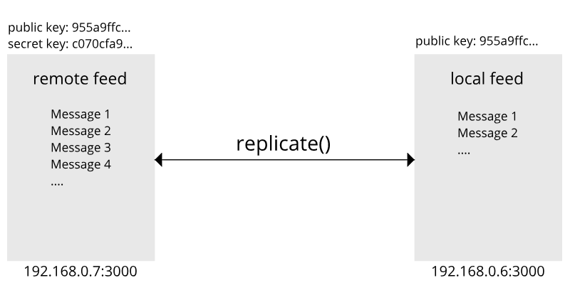

# 4 - Todo se trata de Streams

## Introducción a los Streams de Node

Si has programado en Node.js es muy probable que hayas usado [Streams](https://nodejs.org/api/stream.html)
sin siquiera saberlo.

De hecho, son tan importantes que forman parte del core de Node. Cada request o response de tu
servidor, cada `console.log` u operación sobre el filesystem involucra algun tipo de stream.

Un stream es una interfaz que representa una sequencia de datos `a---b---c` en el tiempo y en donde
la información fluye desde una fuente hacia un destino.

Los streams nos permiten por ejemplo leer un archivo por partes (chunks) a travez de un `ReadableStream`,
aplicarle algun tipo de transformación por medio de un `TransformStream` y escribir cada chunk modificado
en un destino particular con un `WriteableStream`.

Los streams pueden operar en un solo sentido como un ReadableStream que solo lee de una fuente
y envia sus datos al siguiente stream:

```
ReadableStream ---> ( TransformStream | WriteableStream )
```

Pero tambien existen los `DuplexStream` que permiten operaciones tanto de lectura como escritura.
Un ejemplo seria un [Socket](https://nodejs.org/api/net.html#net_new_net_socket_options)

!> Lo importante es tener en cuenta que dichas interfaces existen para definir un unica forma de operar
sobre datos de forma eficiente y escalable. No importa si los datos se leen o escriben desde el disco o de una
conexion de red, los streams hablan un solo lenguaje y eso nos permite combinarlos como necesitemos.

No es parte del workshop avanzar demasiado en este tema pero si queres aprender mas te recomendamos el
[stream-handbook](https://github.com/substack/stream-handbook).

## Streams en Hypercore

Internamente `hypercore` utiliza Streams para cumplir sus objetivos.

### Leyendo nuestros logs

Podemos leer los datos de nuestro `feed` utilizando `feed.createReadStream` y mostrar los datos en pantalla:

```javascript
feed.createReadStream().pipe(console.log)
```

Como veras `console.log` es un `WriteableStream` en donde el destino es escribir en pantalla.

Utilizamos el metodo `pipe` para conectar y definir el flujo de datos de nuestros streams.

```javascript
// a --> b --> c
// unix like: a | b | c
a.pipe(b).pipe(c)
```

### Replicar

Supongamos que tenemos un feed local que utiliza la key publica de un feed remoto. En algun momento vamos
a querer leer sus datos, tenemos su key por lo que podemos desencriptarlos.

Pero antes de desencriptar los datos deberiamos poder obtenerlos, traerlos a nuestro feed local y unificarlos
con los datos que ya tenemos. A este proceso lo llamamos `replicacion`.

Queremos replicar, los datos del feed remoto en nuestro feed local.

Para poder lograrlo, volvemos a utilizar Streams. Hypercore ofrece un `feed.replicate()` que retorna un
TransformStream el cual lee la data de un feed remoto, la incorpora a su feed local y destina el resultado
al siguiente stream.



### Sincronizar

Con `replicate()` podemos replicar los datos de un feed remoto en nuestro feed local pero tambien debemos
pensar que el feed remoto puede estar `desactualizado`.

!> Todos los peers deberian tener tarde o temprano la ultima version de los datos.

Si tomamos en cuenta que la conexion entre dos peers, es bidireccional, podriamos hacer lo siguiente:
```javascript
//                (1)                      (2)
remoteFeed.pipe(localFeed.replicate()).pipe(remoteFeed)
```
1. Primero recibimos los datos de un remote feed y los replicamos en nuestro feed local.
2. Una vez que tenemos nuestro feed actualizado, enviamos los datos nuevamente al feed remoto
para que se actualize en caso de tener data incosistente.
3. Al final, ambos feed tienen la misma version de los datos.

## Ejercicio

1. Crear una funcion que:
  * Reciba una key y un peer remoto.
  * Retorne una promesa
2. La funcion debe sincronizar el feed local.
3. Una vez finalizada la sincronización, leer los datos del feed y cargar
cada mensaje en un array.
4. Una vez finalizada la lectura del feed, retornar el listado de mensajes.

## Test

```
$ npm test 04
```

## Tips

### 1 - Pump

Por implementación de Node, si tenemos streams conectados por `.pipe` y uno de ellos
se destruye, el resto siguen funcionando.

Nosotros queremos que si algun stream se destruye (intencionalmente, por finish o por un error) que todo
los streams conectados tambien lo hagan. Por eso vamos a utilizar el modulo [pump](/pump)
para remplazar a pipe.

Pump nos permite `pipear` nuestros streams y asegurarnos que en caso de que uno se destruya, todos lo hagan.

> Como feature extra, el ultimo argumento de pump puede ser una funcion que se ejecuta
al finalizar todos los streams.

```javascript
a.pipe(b).pipe(c)

// to

pump(a, b, c, err => {
  console.log('finish')
})
```

### 2 - Transformar datos

Imaginen al TransformStream como un `[].map` o un `[].forEach`.

El objetivo es iterar sobre los chunks que recibimos de un ReadableStream o de otro TransformStream.

Construir un TransformStream no es tarea facil, **pero esto es Node muchache!**,
tenemos un modulo que lo resuelve por nosotros: [flush-write-stream](/flush-write-stream).


